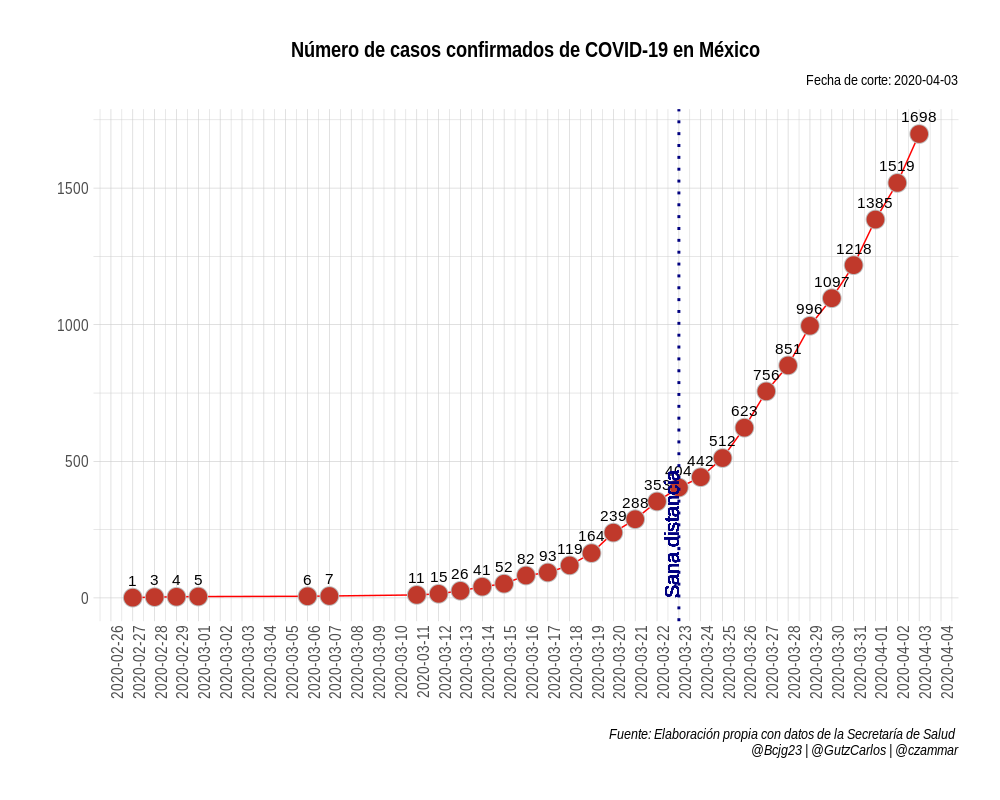
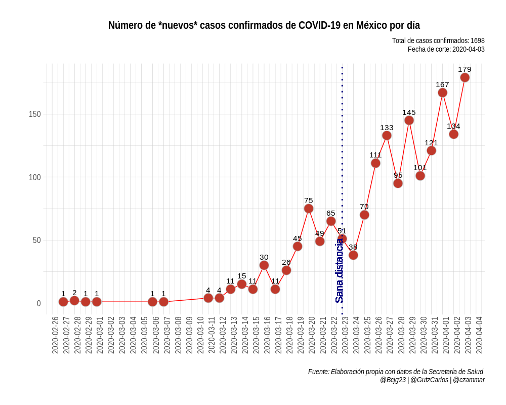
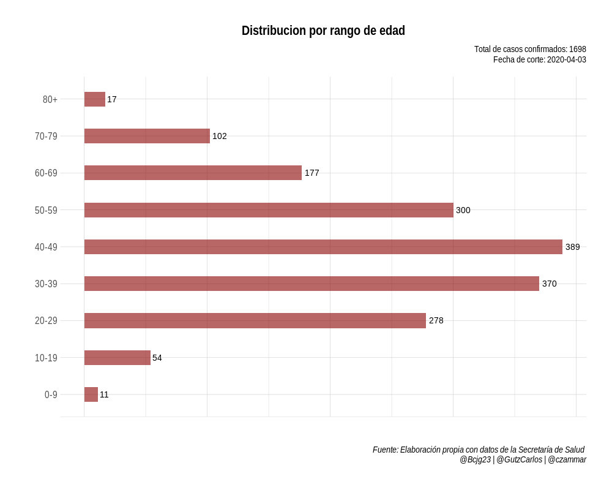
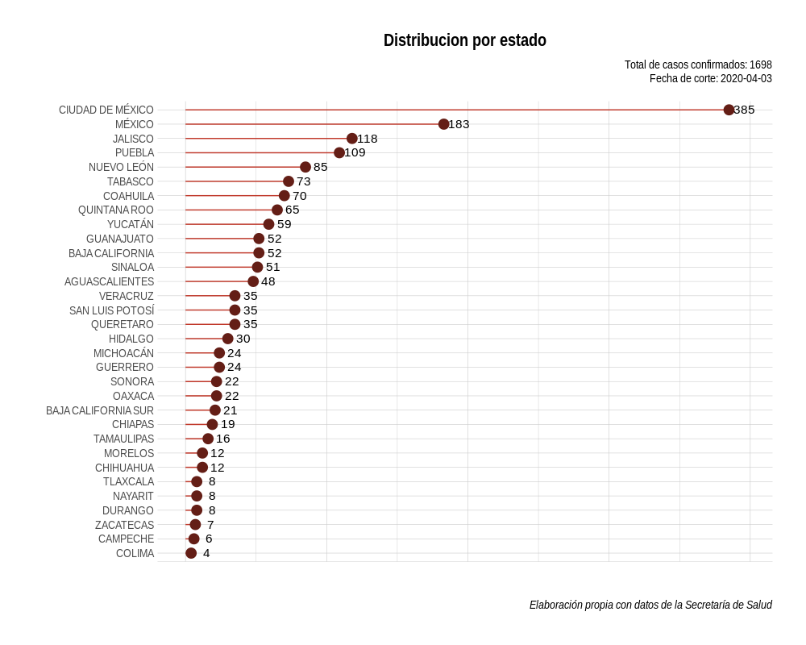
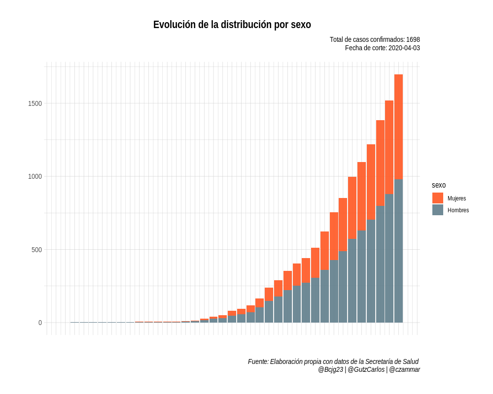
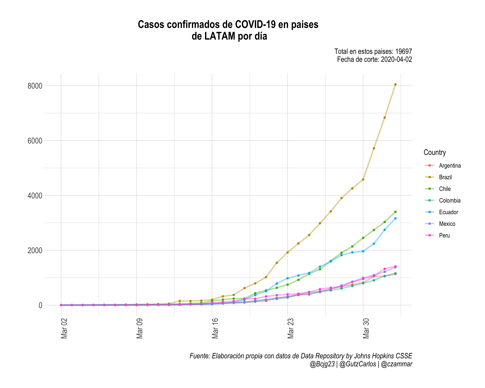
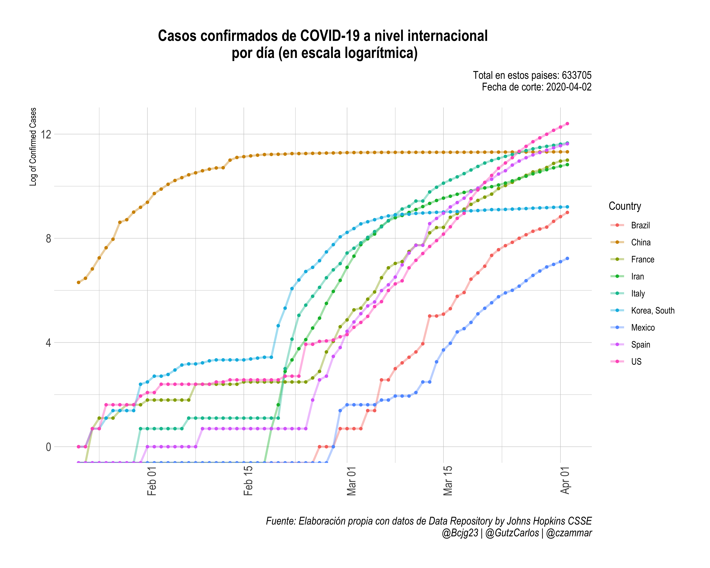

# 1. Objetivo

El Covid19 es un tema de salud pública y como tal queremos ayudar a todos los interesados en el uso, distribución y análisis de los datos que genera la Secretaría de Salud.

# 2. Información

Siguiendo las propuestas de varios actores de la sociedad civil, ponemos a disposición publica los siguientes contenidos:

 **data**: Datos oficiales de casos sospechosos y confirmados publicados por la Secretaría de Salud en formatos **csv** desde el 17 de Marzo de 2020.

  **output**: 

   - Confirmados: Información públicada de los casos confirmados hasta el último corte, con la fecha en que cada uno de los casos fue publicado. Esta base es actualizada diariamente *de manera manual* para incluir los nuevos casos que da a conocer la Secretaría de Salud. Debido a esto podemos incurrir en errores propios o por parte de la misma Secretaría de Salud. 
     
     De hecho, como menciona [@guzmart_](https://github.com/guzmart/covid19_mex) en un ejercicio similar, y corroborado por nosotros, los datos publicados el 20 de Marzo de 2020 toman como un nuevo caso a un paciente ya considerado en la información del día anterior. Ver más información acerca de errores en la sección 4.

   - Acumulados: Datos acumulados de los casos confirmados, sospechosos, negativos, recuperados, fallecidos y portadores obtenidos de los [Comunicados Técnicos Diarios](https://www.gob.mx/salud/documentos/informacion-internacional-y-nacional-sobre-nuevo-coronavirus-2019-ncov) de la Secretaría de Salud.

  **pdf_SS**: Originales de las Tablas de casos positivos (desde el 17 ed Marzo) y sospechosos (desde el 20 de Marzo) que publica la Secretaría de Salud [aquí](https://www.gob.mx/salud/documentos/coronavirus-covid-19-comunicado-tecnico-diario-238449/).

# 3. Análisis

## La Secretaría de Salud ha estado eliminando, sin motivo aparente, diversos registros. Por lo que los datos publicados aquí no coinciden con los números oficiales. 

# 4. Errores de la base

## Tabla de positivos

Las tablas de la Secretaria de Salud reportan diariamente las tablas de casos positivos en formato pdf, resaltando en color *azul* los *casos nuevos*. En esta sección se documentan errores en las versiones de las tablas.

   - En la tabla del 20.03.2020 se marco el **caso 163** como caso nuevo, sin embargo este caso esta confirmado en la tabla del 19.03.2020 (**caso 149**)
   - La tabla del 21-03-2020 no reporta en azul, es decir como casos nuevos, los **casos 226, 227, 228, 229**, pero estos casos no se encuentran en la tabla del 20.03.2020. Además, en la tabla del 20.03.2020 se reporta el **caso 225**, que *desaparece* en la tabla del 21.03.2020.
   - En la tabla del 26.03.2020 ya no se encontró el **caso 302** de la tabla del 25.06.2020.
   - En la tabla del 27.03.2020 ya no se encontró el **caso 339** de la tabla del 25.06.2020.

### Actulizaciones de casos

   - En la tabla del 20.03.2020 se actualizó el número de caso 67
   - En la tabla 21.03.2020 se actualizó el número de caso 64
   - La tabla del 23.03.2020 actualizó los *países de procedencia* de los casos 143, 167, 311 y la *edad* del caso *287*
   - En 
   la tabla del 24.03.2020 actualizó la edad del caso *253* y el país de residencia de caso *368*
   - En la tabla 26.03.2020 actualizó el *país de procedencia* para el caso *201*, para el caso *240* se actualizo la *edad*
   - La tabla del 27.03.2020 actualizó el *país de procedencia* del caso *211*
   
